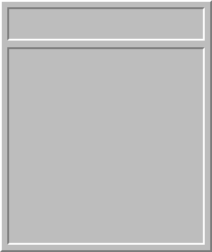

# Minesweeper

Microsoft Minesweeper is a grid-based bomb-avoidance game that was included
in the Windows operating systems of my childhood: Windows 3.1, Windows 95, Windows 98,
Windows ME, and Windows XP.

## Ruby

Ruby is a delightful language for implementing Minesweeper!

The [Gosu](https://www.libgosu.org/) 2D game development library is a perfect fit.
Image rendering is effortless and working with the game loop couldn't be simpler.

## Assets

The PNG bitmap [images](images/) are rasterized from SVG source files that
I drafted based on screenshots of the Windows 98 edition of the game.

           

          

  



## Play

- Left click (covered) - reveal tile
- Left click (revealed) - reveal neighbors if adjacent flag-count equals mine-count
- Right click (covered) - flag tile

```
ruby minesweeper.rb -h
Usage: minesweeper [options]
    -b, --beginner                   Start game in Beginner mode
    -i, --intermediate               Start game in Intermediate mode
    -e, --expert                     Start game in Expert mode
    -h, --help                       Show this help message
```